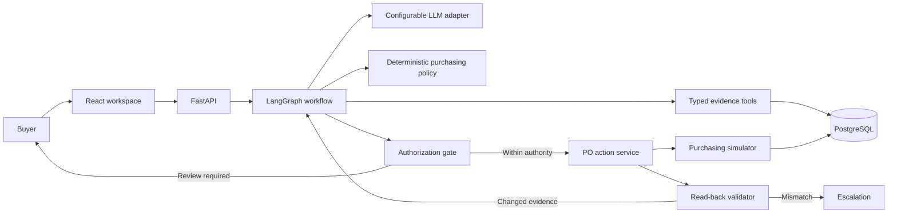

# Architecture

Status: Active; the purchasing backend is implemented and evaluated.

Last updated: 2026-09-14

## System view



The LLM investigates and proposes. Deterministic code controls calculations, hard constraints, authority, database mutations, and success validation.

## Technology

| Area | Choice |
| --- | --- |
| Web | React JavaScript, Vite, Tailwind CSS |
| API and domain | Python, FastAPI, Pydantic |
| Agent orchestration | LangGraph |
| LLM adapters | Gemini, OpenAI, Anthropic |
| Persistence | PostgreSQL, SQLAlchemy, Alembic |
| Graph checkpoints | PostgreSQL LangGraph checkpointer |
| Evaluation | Python runner with deterministic graders |
| Local runtime | Separate Vite and FastAPI processes with local PostgreSQL |
| Reviewer runtime | Docker Compose |

Dependencies are pinned. Provider model names remain environment configuration.

## Purchasing workflow

```text
plan investigation
  -> gather typed evidence
  -> check completeness and freshness
       -> incomplete: investigate and block
       -> complete: calculate time-phased candidates
  -> propose accept / modify / reject / investigate
  -> validate proposal against deterministic policy
  -> authorize
       -> within authority: execute
       -> above authority: pause for buyer review
       -> blocked or rejected: finish without mutation
  -> lock and recheck mutable evidence
       -> changed: replan once
       -> valid: create PO idempotently
  -> read persisted PO back
       -> exact match: complete
       -> mismatch: escalate
```

LangGraph owns transitions, PostgreSQL checkpoints, pause/resume, and bounded replanning. Purchasing formulas remain ordinary Python functions.

## Backend structure

```text
backend/app/
├── agent/
│   ├── graph.py          graph assembly only
│   ├── state.py          shared workflow state
│   ├── prompts.py        live-model instructions
│   ├── routing.py        conditional transitions
│   ├── provider.py       provider resolution and adapters
│   ├── checkpoint.py     PostgreSQL checkpoint boundary
│   └── nodes/            planning, evidence, decision, authorization, execution
├── api/                  validated HTTP contracts
├── domain/               evidence rules, schemas, inventory simulation, policy
├── services/             workflow lifecycle, actions, simulator
├── models.py             relational persistence model
├── purchasing_tools.py   read-only business evidence tools
├── seed.py               deterministic review and scenario cases
└── evaluation.py         complete-case graders and reports
```

There is one agentic workflow, not multiple LLM agents. Planning and proposal use the configured model in live mode. Other nodes are deterministic control points because separate LLMs would not improve those responsibilities.

## API

- `GET /api/health` — verify the API and database.
- `GET /api/cases` — list purchasing cases.
- `GET /api/cases/{case_id}` — return current evidence and the latest run.
- `POST /api/cases/{case_id}/runs` — start an investigation.
- `GET /api/runs/{run_id}` — retrieve a run.
- `POST /api/runs/{run_id}/review` — approve or reject a paused exact action.

The API exposes no provider keys, prompts, database errors, or hidden model reasoning.

## Data and consistency

PostgreSQL stores cases, products, nodes, suppliers, reusable supplier terms, per-case supplier availability, inventory, forecasts, inbound and created purchase orders, budget, storage capacity, agent runs, evidence, policy checks, action attempts, validation results, and LangGraph checkpoints.

- Money uses integer minor units.
- Evidence carries observation timestamps and permitted ages.
- Supplier availability is volatile per case; commercial terms are reusable.
- PO, budget, storage, and supplier availability records are locked and updated in one transaction.
- The action service rechecks current evidence after locking.
- A unique idempotency key prevents duplicate orders; repeated attempts are still audited.
- Success comes only from reading the persisted PO and matching it to the authorized quantity.
- LangGraph deserialization permits no arbitrary Python modules.

## Provider modes

- `AI_MODE=live` requires `LLM_PROVIDER`, `LLM_MODEL`, and the matching provider key. If exactly one key exists, its provider can be inferred.
- `AI_MODE=replay` runs the same graph with deterministic planning and proposal against seeded evidence; it needs no key and is labelled as non-live evaluation.
- A paused live run resumes with its original provider and model rather than silently switching configuration.

## Runtime

Local development runs Vite and FastAPI separately. The browser uses `VITE_API_BASE_URL` to call FastAPI directly, and allowed local origins are explicit.

Docker Compose will package the web, API, and PostgreSQL services for reviewer setup after the buyer workspace is complete.
