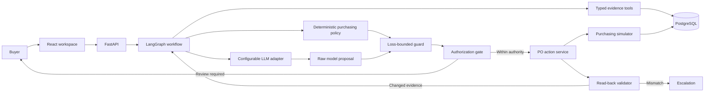

# Architecture

Status: Active; product workflow, evaluation system, UI, and reviewer packaging are implemented.

Last updated: 2026-09-15

## System view



The LLM investigates and proposes without seeing fixture labels. Deterministic code controls calculations, hard constraints, proposal validation, authority, database mutations, and success validation.

## Technology

| Area | Choice |
| --- | --- |
| Web | React JavaScript, Vite, Tailwind CSS |
| API and domain | Python, FastAPI, Pydantic |
| Agent orchestration | LangGraph |
| LLM adapters | Gemini, OpenAI, Anthropic |
| Persistence | PostgreSQL, SQLAlchemy, Alembic |
| Graph checkpoints | PostgreSQL LangGraph checkpointer |
| AI evaluation | Versioned dataset, configured-model graders, repetitions, optional rubric judge |
| Engineering checks | Separate replay-only system and safety regression |
| Local runtime | Separate Vite and FastAPI processes with local PostgreSQL |
| Reviewer runtime | Docker Compose |

Dependencies are pinned. Provider model names remain environment configuration.

## Purchasing workflow

```text
plan investigation
  -> gather typed evidence
  -> check completeness and freshness
       -> missing: replan once for the exact gaps
       -> still incomplete or stale: investigate and block
       -> complete: calculate time-phased candidates
  -> model proposes accept / modify / reject / investigate
  -> preserve the raw proposal
  -> validate it against the private deterministic policy outcome
       -> mismatch: replace with safe investigate and block
       -> match: continue with the guarded decision
  -> authorize
       -> within authority: execute
       -> above authority: pause for buyer review
       -> blocked or rejected: finish without mutation
  -> lock and recheck mutable evidence
       -> changed: replan once
       -> valid: create PO idempotently
  -> read persisted PO back
       -> exact match: complete
       -> mismatch: escalate
```

LangGraph owns transitions, a bounded evidence-gap loop, PostgreSQL checkpoints, pause/resume, and action-time replanning. Purchasing formulas remain ordinary Python functions.

## Tool selection and SQL execution

The configured LLM receives the approved tool catalog and returns a typed `InvestigationPlan` containing selected tool names, purposes, and questions. It never receives SQL access. `gather_evidence` accepts only registered names and dispatches them through `TOOL_REGISTRY`, where SQLAlchemy executes parameterized PostgreSQL queries for the current case.

| Agent tool | PostgreSQL source |
| --- | --- |
| `get_inventory` | Latest `inventory_snapshots` row |
| `get_demand_forecast` | Ordered `demand_forecasts` rows |
| `get_open_purchase_orders` | Open or confirmed `purchase_orders` |
| `get_supplier_terms` | `supplier_terms`, `suppliers`, and case availability |
| `get_budget` | Current `budget_snapshots` row |
| `get_storage_capacity` | Current `capacity_snapshots` row |

This is controlled plan-and-dispatch tool use: the AI decides which approved evidence functions it needs; deterministic code validates the plan and owns database execution. It is not an unrestricted provider-side SQL loop. Missing evidence can return the graph to the LLM for one bounded replan. Arbitrary model-generated queries or tools cannot run.

## Backend structure

```text
backend/app/
├── agent/
│   ├── graph.py          graph assembly only
│   ├── state.py          shared workflow state
│   ├── prompts.py        live-model instructions
│   ├── routing.py        conditional transitions
│   ├── provider.py       provider resolution and adapters
│   ├── checkpoint.py     PostgreSQL checkpoint boundary
│   └── nodes/            planning, evidence, decision, authorization, execution
├── api/                  validated HTTP contracts
├── domain/               evidence rules, schemas, inventory simulation, policy
├── services/             workflow lifecycle, actions, simulator
├── evals/                dataset contract, graders, optional judge, reports
├── models.py             relational persistence model
├── purchasing_tools.py   read-only business evidence tools
├── seed.py               seeds only evaluation inputs
├── system_regression.py  deterministic engineering checks; never model evaluation
└── live_evaluation.py    configured-model experiment runner

backend/evals/
└── purchasing_agent_dataset.json  inputs, evaluator-only references, metadata
```

There is one modular purchasing agent, not a collection of agents pretending that deterministic jobs need model judgment. Planning and proposal use the configured model in live mode. Evidence, calculation, guarding, authorization, execution, and validation remain separate deterministic control points.

## API

- `GET /api/health` — verify the API and database.
- `GET /api/cases` — list the six core tests and public purpose metadata.
- `GET /api/cases/{case_id}` — return current evidence and the latest run.
- `POST /api/cases/{case_id}/runs` — start an investigation.
- `GET /api/runs/{run_id}` — retrieve a run.
- `POST /api/runs/{run_id}/review` — approve or reject a paused exact action.

The API exposes the model's structured proposal, guard result, investigation plan, evidence, and outcome. It exposes no provider keys, prompts, database errors, reference answers, chain-of-thought, or other hidden reasoning.

## Evaluation boundary

```text
versioned example
  ├── input ──> PostgreSQL seed ──> agent graph ──> observed trace
  ├── metadata ──> six-test UI
  └── reference ────────────────────────────────> graders after run
```

Each live trial reseeds the database before the target runs. The experiment records dataset and prompt hashes, model configuration, latency, trace, modular scores, safety failures, and repeated-run consistency. The optional rubric judge sees the reference only after the target and is reported separately from exact correctness. Replay reads the same dataset but measures only deterministic workflow and safety behavior.

## Data and consistency

PostgreSQL stores cases, products, nodes, suppliers, reusable supplier terms, per-case supplier availability, inventory, forecasts, inbound and created purchase orders, budget, storage capacity, agent runs, evidence, policy checks, action attempts, validation results, and LangGraph checkpoints.

- Money uses integer minor units.
- Evidence carries observation timestamps and permitted ages.
- Supplier availability is volatile per case; commercial terms are reusable.
- PO, budget, storage, and supplier availability records are locked and updated in one transaction.
- The action service rechecks current evidence after locking.
- A unique idempotency key prevents duplicate orders; repeated attempts are still audited.
- Success comes only from reading the persisted PO and matching it to the authorized quantity.
- LangGraph deserialization permits no arbitrary Python modules.

## Provider modes

- `AI_MODE=live` requires `LLM_PROVIDER`, `LLM_MODEL`, and the matching provider key. If exactly one key exists, its provider can be inferred.
- `AI_MODE=replay` runs the same graph with deterministic planning and proposal against seeded evidence; it needs no key and is labelled only as system/safety regression.
- A paused live run resumes with its original provider and model rather than silently switching configuration.

## Runtime

Local development runs Vite and FastAPI separately. The browser uses `VITE_API_BASE_URL` to call FastAPI directly, and allowed local origins are explicit.

Docker Compose packages PostgreSQL, the migrated and seeded API, and a production-built React app for reviewer startup. The native development workflow remains unchanged.
