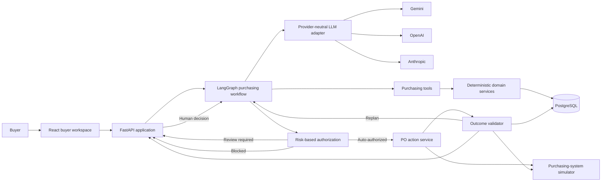

# Architecture

Status: Active; the runtime foundation is implemented and purchasing capabilities are next.

Last updated: 2026-09-14

## System view



The LLM investigates and proposes. Deterministic services decide feasibility and authorization. The action service is the only component permitted to mutate purchasing state, and the validator independently decides whether the action succeeded.

## Technology stack

| Area | Choice |
| --- | --- |
| Web application | React JavaScript, Vite, Tailwind CSS |
| API and domain | Python, FastAPI, Pydantic |
| Agent orchestration | LangGraph |
| LLM providers | Gemini, OpenAI, Anthropic through adapters |
| Persistence | PostgreSQL, SQLAlchemy, Alembic |
| Graph checkpoints | PostgreSQL LangGraph checkpointer |
| Evaluation | Python evaluation runner with deterministic graders |
| Development runtime | Native Vite and FastAPI processes with local PostgreSQL |
| Reviewer runtime | Docker Compose |
| Continuous checks | GitHub Actions, ESLint, Prettier |

Dependencies are pinned in `backend/requirements.txt` and `frontend/package-lock.json`. Model names are configuration, not architecture.

## Purchasing graph

The graph uses one state model for every purchasing event:

```text
ingest_case
  -> gather_evidence
  -> assess_evidence
  -> calculate_requirement
  -> propose_plan
  -> validate_plan
  -> authorize_action
       -> execute_action
       -> wait_for_human
       -> close_blocked
  -> validate_outcome
       -> complete
       -> replan
       -> escalate
```

LangGraph owns state transitions, checkpointing, retries, and resume behavior. It does not contain purchasing formulas or database queries.

## Component responsibilities

| Component | Responsibility |
| --- | --- |
| Buyer workspace | Show cases, evidence, calculations, decisions, authorization, action, and validation. Collect human input only when requested. |
| FastAPI application | Validate HTTP boundaries, start/resume runs, return case state, and expose evaluation reports. |
| Purchasing graph | Coordinate investigation, planning, authorization, action, validation, replanning, and escalation. |
| LLM adapter | Normalize provider configuration, tool binding, messages, and structured output. |
| Purchasing tools | Retrieve inventory, forecast, open POs, supplier terms, alternatives, budget, and capacity. |
| Domain services | Calculate need and enforce freshness, quantity, supplier, budget, storage, timing, and authorization rules. |
| Action service | Execute idempotent create/amend/cancel operations against the simulator. |
| Outcome validator | Read actual state and compare it with the authorized action and current constraints. |
| Repositories | Isolate SQLAlchemy persistence from domain and graph code. |
| Purchasing simulator | Behave like an external system and support deterministic success and failure modes. |

## Provider resolution

Configuration uses `LLM_PROVIDER`, `LLM_MODEL`, and the relevant provider key.

- When `LLM_PROVIDER` is set, its model and key must be valid.
- When it is omitted and exactly one supported provider key exists, that provider is selected.
- When multiple provider keys exist without an explicit provider, startup fails with a clear configuration error rather than selecting arbitrarily.
- `AI_MODE=live` invokes the configured provider.
- `AI_MODE=replay` loads checked-in traces for UI inspection and is never accepted as a live evaluation result.

Provider-specific imports stay inside adapters. Graph state, tool contracts, domain services, and evaluation fixtures remain provider-neutral.

## API boundary

The planned API surface is intentionally small:

- `GET /api/cases` — list purchasing cases.
- `GET /api/cases/{case_id}` — return evidence, run state, and audit timeline.
- `POST /api/cases/{case_id}/runs` — start or re-run an investigation.
- `POST /api/runs/{run_id}/review` — resume a paused run with a human decision.
- `GET /api/runs/{run_id}` — retrieve current decision, action, and validation state.
- `GET /api/evaluations/{evaluation_id}` — retrieve an evaluation report.

The API never exposes provider keys, internal prompts, raw database errors, or hidden reasoning.

## Persistence model

PostgreSQL stores:

- purchasing cases and trigger events;
- products, nodes, suppliers, and supplier terms;
- inventory and capacity snapshots;
- demand forecasts and recent sales evidence;
- purchase orders and lines;
- budgets and committed spend;
- graph checkpoints and run state;
- tool-call evidence and policy results;
- decisions and authorizations;
- action attempts and idempotency keys; and
- validation and escalation results.

Structured business fields remain relational. Evidence snapshots, provider metadata, and tool traces may use JSONB where their shape is naturally variable.

## Consistency and failure handling

- Validate every API, tool, and LLM boundary with Pydantic schemas.
- Represent money as integer minor units or `Decimal`, never binary floating point.
- Record the evidence version used for each decision and recheck mutable data before execution.
- Lock or version records involved in a purchasing mutation and update the PO, budget commitment, and capacity reservation atomically.
- Use a unique idempotency key so a retry cannot create a duplicate order.
- Apply bounded retry only to explicitly retryable failures.
- Validate from persisted simulator state rather than the action response.
- Persist every state transition under one trace ID without storing secrets or hidden model reasoning.

## Runtime environments

During development, the Vite web process and FastAPI process run directly on macOS and connect to a local PostgreSQL service. This keeps feedback loops fast and makes each layer easy to inspect.

Vite and FastAPI are started separately. The browser connects directly to FastAPI using `VITE_API_BASE_URL`; allowed local origins are explicit in API configuration.

For reviewers, Docker Compose will run three services:

- `web`: React/Vite application;
- `api`: FastAPI, LangGraph, domain services, simulator, and evaluation runner; and
- `db`: PostgreSQL with a health check and persistent development volume.

The simulator stays behind an integration interface so its failure behavior is realistic without requiring an external purchasing account.
